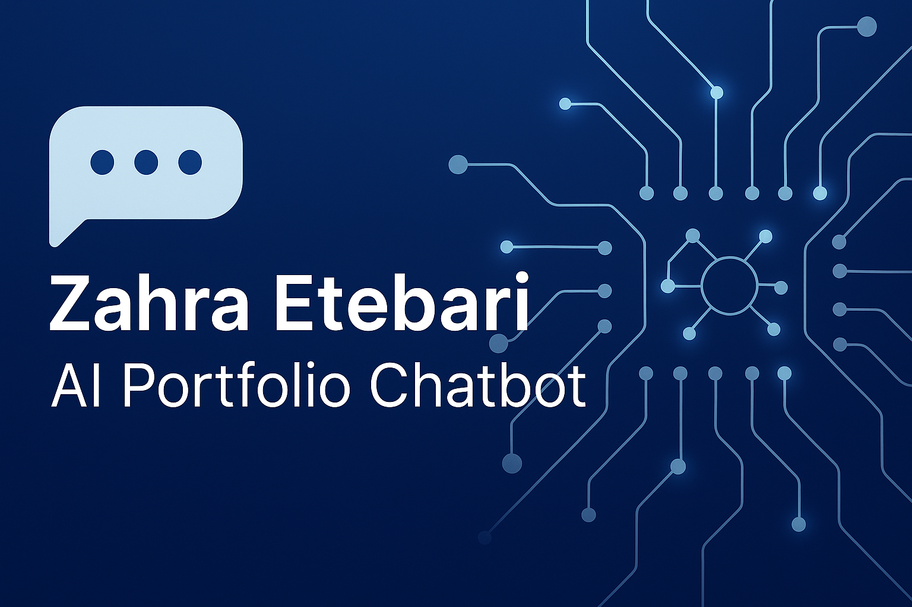

# 🌌 Zahra's Galaxy Portfolio Chatbot

An interactive, AI-powered portfolio chatbot featuring a stunning galaxy theme with animated stars, nebula effects, and intelligent responses about Zahra Etebari's AI/ML projects and expertise.

##  Features

-  **Galaxy Theme**: Beautiful cosmic background with animated stars and nebula effects
-  **Interactive Chat**: Intelligent pattern-matching chatbot
-  **Modern UI**: Glassmorphism effects and smooth animations
-  **Fully Responsive**: Works perfectly on desktop, tablet, and mobile
-  **Fast & Lightweight**: Built with React, no external API calls needed
-  **Smart Responses**: Comprehensive information about Zahra's portfolio

##  What the Chatbot Knows

### About Zahra Etebari
- AI Engineer & Machine Learning Specialist
- Master's degree in Computer Science
- Expertise in NLP, Computer Vision, and Deep Learning

### 5 Featured Projects
1. **AI Portfolio Chatbot with RAG** - FastAPI + FAISS vector search
2. **Live Speech-to-Text Translation PWA** - 20+ languages support
3. **Object Detection & Tracking** - YOLOv8 implementation
4. **Speech Recognition System** - LSTM/Transformer models
5. **Customer Segmentation** - Multiple ML algorithms

### Technical Skills
- Machine Learning & Deep Learning
- Natural Language Processing
- Computer Vision & Object Detection
- Python, TensorFlow, PyTorch
- FastAPI, RAG, FAISS
- And much more!

### Prerequisites
- Node.js (v14 or higher)
- npm or yarn

##  Built With

- **React 18** - UI framework
- **Lucide React** - Icon library
- **Tailwind CSS** - Styling (inline classes)
- **JavaScript ES6+** - Programming language

##  Browser Support

- Chrome (latest)
- Firefox (latest)
- Safari (latest)
- Edge (latest)

##  Contributing

Contributions are welcome! Please feel free to submit a Pull Request.

1. Fork the project
2. Create your feature branch (`git checkout -b feature/AmazingFeature`)
3. Commit your changes (`git commit -m 'Add some AmazingFeature'`)
4. Push to the branch (`git push origin feature/AmazingFeature`)
5. Open a Pull Request

##  Author

**Zahra Etebari**
- Portfolio: [zahra-etebari-portfolio.netlify.app](https://zahra-etebari-portfolio.netlify.app/)
- GitHub: [@Zahra58](https://github.com/Zahra58)

##  Acknowledgments

- Inspired by modern AI chatbot interfaces
- Galaxy theme inspired by space exploration
- Built with passion for AI and beautiful UX

##  Support

If you have any questions or run into issues, please open an issue on GitHub.

---

Made with 💜 by Zahra Etebari | © 2025

(This public repo only includes the README and banner. The chatbot backend remains private.)

ai-portfolio-chatbot-demo/
├── images/
│   └── zahra-portfolio-chatbot.png
├── README.md
└── LICENSE

 Try the Live Demo

 Launch Chatbot Demo

(Replace the link above once your chatbot is deployed on Render or Hugging Face Spaces.)

 Features

✅ Interactive chat with your portfolio
✅ Retrieval-based Q&A (RAG)
✅ Secure — backend code private
✅ Real project context (Speech, Vision, Data Science)

 License

This repository is released under the MIT License
.
The chatbot backend and data embeddings remain private.
---

